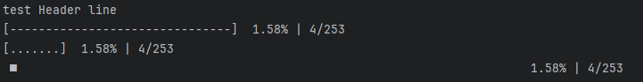
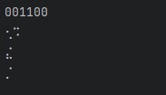

<div align="center">
  
<p>Yet Another Spinner Lib</p>
<p style="margin-top: -10px;">Elevate your Rust command-line interfaces with 100+ spinner animations and Progress Bars + multiline support</p>
  <a href="https://github.com/Arteiii/zenity/actions/workflows/publish_crate.yml">
    
  </a>
  <a href="https://github.com/Arteiii/zenity/actions/workflows/release_examples.yml">
    
  </a>
  
  
  <br>
  <a href="https://www.codefactor.io/repository/github/arteiii/zenity">
    
  </a>
</div>






[**CHANGELOG**](CHANGELOG.md)

Do you often find yourself gazing into the void of your terminal, 
wondering if your computer has decided to take a coffee break without notifying you?

100+ predefined animations

[List Of Animations](https://docs.rs/zenity/latest/zenity/animations/frames/spinner/struct.PreDefined.html)


## Introducing

After countless late nights spent wrestling with terminal buffers and ASCII art,
after enduring more trial and error than we care to admit,
we proudly present to you our humble attempt to transform loading animations from a headache into a delight

## How to Use?

It's as easy as pie (or maybe even easier, depending on your pie-making skills)! Just follow these simple steps:

```rust
// example/basic.rs
use std::thread::sleep;
use std::time::Duration;
use zenity::spinner::MultiSpinner;

fn main() {
    // create a LoadingAnimation instance using one of the predefined animations
    let spinner = MultiSpinner::default();

    // optional:
    spinner.set_text(&spinner.get_last(), "Loading...".to_string()); // sets the text to "Loading..."

    sleep(Duration::from_secs(5));
    // `loading_animation` will run out of scope now and get dropped,
    // thus the animation will stop and remove itself from the console
}
```

check out the examples for more

**NOTE:**

- the lib already includes checks for `--color` following the conventions by: [Rain's Rust CLI recommendations](https://rust-cli-recommendations.sunshowers.io/colors.html#general-recommendations)


## Disclaimer

Now, we won't promise you that cli_loading_magic will solve all your problems.
We can't guarantee it won't crash your terminal or cause your computer to sprout legs and walk away in protest.
But hey, life's an adventure, right? Embrace the chaos, enjoy the ride, and remember: if all else fails, there's always Ctrl+C.

Feel free to create an issue with suggestions or bug reports.

## Credits

This project wouldn't have been possible without the amazing work of the following projects:

### Animations

These projects not only provided delightful animations but also spared me from the arduous task of creating frames myself (who wants to do that anyway?)

- [Spinner](https://github.com/FGRibreau/spinners)
- [spinoff](https://github.com/ad4mx/spinoff)

### Documentation

- [ChatGPT](https://chat.openai.com/)

### Dependencies

- [Crossterm](https://github.com/crossterm-rs/crossterm)
- [supports_color](https://docs.rs/supports-color/latest/supports_color/)


## Contribution

Contributions are welcome!

### How to Contribute

1. Fork the repository
2. Create your feature branch (`git checkout -b feature/YourFeature`)
3. Commit your changes (`git commit -am 'Add some feature'`)
4. Push to the branch (`git push origin feature/YourFeature`)
5. Create a new Pull Request

## Feature Requests and Bug Reports

If you have any ideas for new features or encounter any bugs while using Zenity, please don't hesitate to open an issue on [GitHub](https://github.com/Arteiii/zenity/issues). Your feedback is valuable and will help improve the library for everyone.


## License

This project is licensed under the **DWFYW** License.

For more information, see the [LICENSE](LICENSE.md) file.

### Copyright (c) 2024 Ben
